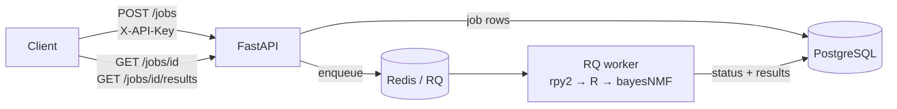

# SigServe

[](https://github.com/nishanthbasava/sigserve/actions/workflows/ci.yml)

A REST API and job queue around [bayesNMF](https://github.com/jennalandy/bayesNMF) —
submit mutation-count matrices over HTTP and poll for Bayesian NMF mutational
signature results, no R required on the client.

Signature analysis with bayesNMF normally means running an R session for
minutes-to-hours per fit. SigServe turns that into an async web service: jobs
are validated and queued instantly, Gibbs sampling runs on background workers,
and results (MAP signature and exposure matrices plus convergence diagnostics)
are fetched when ready.

## Architecture



- **FastAPI** — validation (matrix shape, non-negative counts, rank vs.
  dimensions), hashed API-key auth, job CRUD.
- **Redis + RQ** — queue and per-job hard timeouts; a failure callback in the
  worker parent catches killed work-horses.
- **PostgreSQL** — source of truth for job state and results (Alembic
  migrations, applied on API startup).
- **Worker image** — R + bayesNMF (pinned commit) bridged via rpy2; embedded R
  initializes in the per-job fork. Scale sampler throughput with
  `--scale worker=N`.
- **Maintenance service** — fails orphaned running jobs, prunes old ones.

## API

Mint a key, then talk JSON with the `X-API-Key` header:

```bash
docker compose exec api python -m sigserve.cli create-key --name alice
```

```bash
# Submit: matrix rows are mutation types, columns are samples
curl -X POST localhost:8000/jobs \
  -H "Content-Type: application/json" -H "X-API-Key: $KEY" \
  -d '{"matrix": [[12,3],[5,8],[9,1]], "params": {"rank": 2, "max_iters": 2000}}'

curl localhost:8000/jobs/<id>          -H "X-API-Key: $KEY"   # status
curl localhost:8000/jobs/<id>/results  -H "X-API-Key: $KEY"   # 409 until finished
curl localhost:8000/jobs               -H "X-API-Key: $KEY"   # list my jobs
curl -X DELETE localhost:8000/jobs/<id> -H "X-API-Key: $KEY"  # cancel
```

Interactive docs at `/docs`. Parameters: `rank` (1–20, ≤ smaller matrix
dimension) and `max_iters` (100–20 000). Results contain `signatures`
(types × rank), `exposures` (rank × samples), and `diagnostics` (engine,
convergence, timing).

## Development

Requires Python 3.11+.

```bash
uv venv --python 3.13
uv pip install -e ".[dev]"
.venv/bin/pytest          # unit tests (SQLite + fakeredis, no services)
```

Full stack and integration tests:

```bash
cp .env.example .env
docker compose up -d --build
.venv/bin/pytest -m integration
```

Golden tests check that the real sampler recovers planted signatures; they
need R, so they run inside the worker image:

```bash
docker compose run --rm --no-deps -v ./tests:/app/tests worker \
    sh -c 'pip install -q ".[dev]" && pytest -m golden'
```

CI runs lint + unit tests (coverage gated at 85%) on every push, then builds
the stack and runs the end-to-end and golden tests against the real sampler.

## Performance

`scripts/loadtest.js` (k6) drives the submit/poll path — see the script
header for how to run it. Measured at 20 concurrent users, 90 s, zero
failures:

| Environment | Throughput | p95 latency |
|---|---|---|
| AWS EC2 (m7i-flex.large, full TLS path via Caddy) | 191 req/s | 89 ms |
| Local Docker stack (M-series Mac) | 282 req/s | 24 ms |

Sampler throughput scales separately with worker count (one MCMC per
worker).

## Deployment

One VM, Docker Compose, Caddy for automatic HTTPS:

```bash
export SIGSERVE_DOMAIN=sigserve.example.com
docker compose -f docker-compose.prod.yml up -d --build
```

Full EC2 runbook in [docs/deploy.md](docs/deploy.md).

## Acknowledgments

The sampler is [bayesNMF](https://github.com/jennalandy/bayesNMF) by Jenna
Landy; SigServe pins a specific commit and adds no statistical methodology of
its own.
